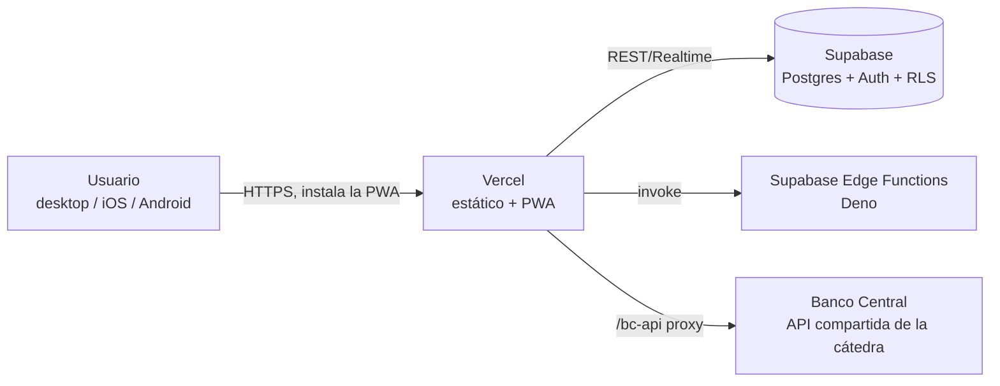

# Manual de despliegue — Monix

**Fecha:** 2026-09-30

Guía de referencia para levantar, desplegar y mantener Monix en producción. Pensada para cualquiera del equipo (o el profesor) que necesite entender cómo se pone en marcha el sistema sin reconstruir el contexto desde cero. No documenta el negocio de la app (para eso están los demás `.md` de `docs/`), sólo el circuito de despliegue.

Monix es 100% web: un mismo build de Vite se despliega una sola vez y se instala como PWA en desktop, iOS y Android. No hay build nativo ni distribución por APK.

## 1. Arquitectura



| Pieza | Qué es | Dónde vive |
| --- | --- | --- |
| Frontend | React + TypeScript + Vite, PWA con Workbox | este repo, `src/` |
| Hosting | Vercel (deploy automático al pushear a `main`) | proyecto Vercel enlazado al repo de GitHub |
| Backend | Supabase: Postgres con RLS, Auth, Realtime, Edge Functions | proyecto Supabase (ver `src/lib/supabaseClient.ts`) |
| API externa | "Banco Central" de la cátedra, simula el sistema interbancario real | `https://centralbank.brocoly.cc`, vía el proxy `/bc-api` (nunca directo desde el navegador) |

Un solo entorno: no hay staging, `main` **es** producción. Para probar algo riesgoso (una migración destructiva, por ejemplo) conviene crear una rama de base de datos temporal en Supabase (`mcp__supabase__create_branch` si se trabaja con un agente, o desde el Dashboard) en vez de probar directo contra la base real.

## 2. Puesta en marcha en local

```bash
git clone https://github.com/Maxi12141/HomebankingMonix.git
cd HomebankingMonix
npm install
cp .env.example .env.local   # completar con los valores reales, ver §3
npm run dev                  # http://localhost:5173
```

| Comando | Para qué |
| --- | --- |
| `npm run dev` | Servidor de desarrollo con hot reload |
| `npm run build` | `tsc && vite build` — build de producción en `dist/` |
| `npm run preview` | Sirve el resultado de `npm run build` localmente, para probar el build real antes de pushear |

No hay suite de tests automatizada ni CI configurado (no existe `.github/workflows`) — la única red de seguridad antes de un deploy es que `tsc` falle si hay un error de tipos, y el checklist manual de §9. Por eso ese checklist importa: hoy es la única verificación real de que una release no rompió nada.

## 3. Variables de entorno

Están documentadas en `.env.example` — copiarlo a `.env.local` para desarrollo:

| Variable | Para qué | De dónde sale |
| --- | --- | --- |
| `VITE_SUPABASE_URL` | URL del proyecto Supabase | Dashboard de Supabase → Project Settings → API |
| `VITE_SUPABASE_ANON_KEY` | Clave pública (anon) del cliente | Idem — nunca usar la `service_role` acá, esa sólo va del lado servidor |
| `VITE_BC_URL` | Base para llamar al Banco Central | `/bc-api` en producción (rewrite de `vercel.json`) o el proxy de `vite.config.ts` en local |
| `VITE_BC_API_KEY` | Autenticación contra el Banco Central de la cátedra | la entrega el profesor |
| `VITE_BC_ENV` | Ambiente del Banco Central (`test`/`prod`) | normalmente `test` |

**En Vercel** estas mismas variables se cargan en Project Settings → Environment Variables (no alcanza con tenerlas sólo en `.env.local`, eso no viaja al build de Vercel). `.env.local` está en `.gitignore` — si alguna vez se commitea una clave por error, se rota desde el Dashboard correspondiente, no alcanza con borrarla del commit.

Aparte de estas, hay secrets que viven **sólo del lado de Supabase Edge Functions**, nunca en el frontend — ver §5.3.

## 4. Despliegue del frontend (Vercel)

1. Cada push a `main` dispara un deploy automático (Vercel ya está enlazado al repo de GitHub `Maxi12141/HomebankingMonix`). Un PR genera un preview deploy con su propia URL.
2. Build command: `npm run build` (que en realidad corre `tsc && vite build` — un error de tipos rompe el build a propósito, es la red de seguridad antes de subir nada).
3. Output dir: `dist/` (default de Vite, no hace falta configurarlo a mano).
4. `vercel.json` hace tres cosas que **no son opcionales**, si se reescribe hay que preservarlas:
   - Reescribe `/bc-api/:path*` hacia `https://centralbank.brocoly.cc/api/:path*` — sin esto, el banco central no responde en producción aunque funcione en local (el proxy de `vite.config.ts` sólo corre en `npm run dev`).
   - Fuerza `Cache-Control: no-cache` en `/` y `/index.html` — el service worker de la PWA necesita que el shell HTML siempre se pida fresco, sino la gente queda pegada en una versión vieja de la app indefinidamente.
   - `Permissions-Policy` habilitando cámara/micrófono/NFC/WebAuthn — sin esto el navegador bloquea esos permisos aunque el usuario los acepte (afecta escaneo de QR, huella y pago con tarjeta).
5. Verificar el deploy: abrir la preview/production URL y correr el checklist de §9 antes de dar por buena una release.
6. **Rollback**: en el dashboard de Vercel, pestaña Deployments, elegir un deploy anterior que haya sido bueno y "Promote to Production". Es inmediato y no requiere revertir nada en git (aunque revertir el commit igual es buena práctica para que `main` no mienta sobre qué está en producción).

## 5. Backend (Supabase)

### 5.1 Migraciones SQL

Las migraciones viven como archivos sueltos en `supabase/*.sql` (no hay todavía un runner tipo `supabase migration up` integrado al flujo — se aplican a mano). Para aplicar una:

- Desde Supabase Studio → SQL Editor, pegar y correr el archivo, o
- Con el MCP de Supabase (`mcp__supabase__apply_migration`) si se está trabajando con un agente que tenga esa conexión.

Orden recomendado en un proyecto nuevo: `policies.sql` primero (RLS), después el resto según el orden en que se fueron creando las features (`cuentas_moneda.sql`, `personas_credito.sql`, `personas_situacion_crediticia.sql`, `reservas.sql`, `depositar.sql`, `prestamos.sql`, `transferencia_atomica.sql` al final, porque reemplaza funciones que dependen de las tablas anteriores).

### 5.2 Row Level Security

Todas las tablas tienen RLS activado (`policies.sql`). Si algo "no aparece" del lado del cliente pero sí existe en la tabla, sospechar primero de una política faltante antes de asumir un bug de la app.

### 5.3 Edge Functions

Hoy corren funciones Deno como `firmar-qr` (firma JWT para el QR interbancario). **Pendiente conocido:** el código fuente de estas funciones no está commiteado en este repo — se desplegaron directo al proyecto de Supabase. Recomendación para el que retome esto: crear `supabase/functions/<nombre>/index.ts` en el repo y desplegar desde ahí, para que el código de producción no viva sólo en el dashboard de Supabase.

Para desplegar una función:
```bash
npx supabase functions deploy <nombre> --project-ref <ref>
```
(requiere `supabase login` interactivo — si se está en un entorno no interactivo, usar el MCP `mcp__supabase__deploy_edge_function`).

**CORS**: Supabase no agrega headers CORS automáticamente a funciones propias. Toda función nueva que reciba `fetch` desde el navegador necesita manejar `OPTIONS` y devolver `Access-Control-Allow-Origin` a mano, o el preflight la bloquea en silencio (se vio este caso con `firmar-qr`, ver `docs/qr-interbancario-jwt.md`).

**Secrets**: se configuran en Dashboard → Edge Functions → Secrets (`Deno.env.get('NOMBRE')` del lado de la función). Ejemplo pendiente: `QR_JWT_PRIVATE_KEY` — hoy `firmar-qr` tiene un fallback embebido en el código porque no hubo forma de setear el secret desde un entorno no interactivo; migrarlo es sólo cargar el secret en el Dashboard, la función ya lo prioriza si existe.

### 5.4 Configuración de Auth (importante en un proyecto Supabase nuevo)

Si se levanta este proyecto contra un Supabase nuevo (no el que ya está en uso), dos cosas de **Authentication → Settings / URL Configuration** rompen el flujo si no se tocan:

- **"Confirm email" debe estar desactivado** (o el flujo de registro adaptado): `RegisterPage.tsx` llama a `supabase.auth.signUp()` esperando que el usuario quede logueado al toque (dispara `onAuthStateChange` de inmediato). Si la confirmación por mail está activa, el usuario queda sin sesión hasta que confirma, y el alta se ve "rota".
- **Redirect URLs**: agregar `<url-de-producción>/restablecer-contrasena` (y el equivalente de `localhost:5173` para desarrollo) a la lista de URLs permitidas — si no está, el link de "olvidé mi contraseña" (`ForgotPasswordPage.tsx`) redirige a un lugar no autorizado y Supabase lo rechaza.
- La plantilla de mail de recuperación de contraseña con la identidad de Monix vive en `docs/email-recuperar-contrasena.html` — pegarla en Authentication → Email Templates → Reset Password.

## 6. PWA — el único camino de instalación (desktop, iOS y Android)

- Manifest e iconos generados por `vite-plugin-pwa` (`vite.config.ts`), assets en `public/` (`pwa-64x64.png`, `pwa-192x192.png`, `pwa-512x512.png`, `maskable-icon-512x512.png`).
- `registerType: 'prompt'` con registro manual en `src/main.tsx` (no automático) para poder controlar el aviso de actualización con el mismo patrón de toast que usa el resto de la app (`src/native/registrarPwa.tsx`).
- El botón de instalar (`src/hooks/usePwaInstall.ts` + `src/lib/pwaInstallPrompt.ts`) depende de que el navegador dispare `beforeinstallprompt` — eso requiere HTTPS real (Vercel ya lo da) y que el manifest + service worker pasen los criterios de instalabilidad de Chrome.
- Para verificar que una build es instalable: Chrome DevTools → Application → Manifest (sin errores) y → Service Workers (activo y controlando la página), o correr Lighthouse → PWA.

**Compatibilidad real del botón "Instalar":**

| Navegador | Comportamiento |
| --- | --- |
| Chrome / Edge (Android y desktop) | Dispara `beforeinstallprompt`, instalación con un tap |
| Safari (iOS y macOS) | Nunca dispara el evento — se indica el paso manual (Compartir → Agregar a Inicio) |
| Firefox (cualquier plataforma) | No soporta `beforeinstallprompt` — el botón cae a "no disponible", no hay forma de instalar con un tap |

## 7. Seguridad — qué no romper

- **RLS siempre activo** en toda tabla nueva (`policies.sql` es el lugar). Una tabla sin política es un tabla que cualquier usuario autenticado puede leer/escribir entera.
- **`service_role` nunca va al frontend.** Sólo `anon` (pública, protegida por RLS) sale en `VITE_SUPABASE_ANON_KEY`. Si `service_role` se necesita en algún momento (para saltar RLS a propósito), sólo dentro de una Edge Function.
- **`Permissions-Policy`** en `vercel.json` es lo que permite pedir cámara/NFC/WebAuthn — no sacarla al tocar ese archivo.
- **Rate limiting es sólo del lado del cliente** (backoff progresivo en `LoginPage.tsx` tras intentos fallidos) — no hay límite real del lado del servidor. Es una limitación conocida, no un bug a arreglar acá.
- Nunca commitear `.env.local` ni ninguna clave — está en `.gitignore`, y si igual pasa, rotar la clave, no sólo borrar el commit.

## 8. Monitoreo y logs

No hay un servicio de error tracking integrado (Sentry o similar) — hoy el diagnóstico en producción es manual:

| Qué pasó | Dónde mirar |
| --- | --- |
| El build falló en Vercel | Vercel → Deployments → el deploy en rojo → Build Logs |
| Algo falla ya desplegado (runtime) | Consola del navegador (F12) — es una SPA estática, no hay logs de servidor del lado del frontend |
| Una Edge Function falla | Supabase Dashboard → Edge Functions → Logs, o `mcp__supabase__query_logs` si se trabaja con un agente |
| Dudas sobre RLS/datos | Supabase Dashboard → Table Editor / SQL Editor, o `mcp__supabase__get_advisors` para chequeos de seguridad automáticos |

## 9. Checklist post-despliegue (smoke test)

Antes de dar una release por buena, probar en la URL de producción (no sólo en local):

- [ ] Registro de una cuenta nueva completa el wizard y llega al dashboard.
- [ ] Login con email/contraseña y, en un celular, con huella.
- [ ] Transferencia interna (Monix → Monix) y externa (CBU de otro banco vía Banco Central) se acreditan y aparecen en el historial.
- [ ] QR propio se genera y un escaneo lo paga correctamente (tanto el flujo interno con seguimiento en tiempo real como el interbancario firmado).
- [ ] Simulador de Préstamos calcula cuota/total y permite solicitar uno.
- [ ] El botón "Instalar app" funciona en Chrome/Android (no cae siempre a "no disponible").
- [ ] Abrir la app instalada como PWA y confirmar que detecta una versión nueva sin necesidad de desinstalar/reinstalar.

## 10. Troubleshooting conocido

| Síntoma | Causa típica | Dónde mirar |
| --- | --- | --- |
| El Banco Central da 404/CORS en producción pero anda en local | Falta el rewrite `/bc-api` en `vercel.json`, o se llamó directo a `centralbank.brocoly.cc` desde el navegador | `vercel.json`, `services/bancoCentral.ts` |
| Una Edge Function nueva falla con "blocked by CORS policy" | Falta manejar `OPTIONS` + `Access-Control-Allow-Origin` en la función | código de la función en Supabase, ver ejemplo en `docs/qr-interbancario-jwt.md` |
| La PWA instalada queda en una versión vieja | El service worker no fuerza el chequeo de actualización seguido, o el HTML quedó cacheado | `src/native/registrarPwa.tsx`, headers `no-cache` de `vercel.json` |
| El botón de instalar siempre dice "no disponible" en Chrome | El evento `beforeinstallprompt` se perdió porque nadie lo escuchaba a tiempo (splash screen inicial) | `src/lib/pwaInstallPrompt.ts` — debe importarse eager desde `main.tsx` |
| Un usuario nuevo se registra pero queda sin sesión / "colgado" | Falta desactivar "Confirm email" en un proyecto Supabase nuevo (ver §5.4) | Supabase Dashboard → Authentication → Settings |
| El link de "olvidé mi contraseña" no funciona | La URL de redirect no está en la lista permitida (ver §5.4) | Supabase Dashboard → Authentication → URL Configuration |

---

Los pendientes de todo el proyecto (no sólo de despliegue) se llevan en `docs/auditoria-completa-2026-09-21.md`.
