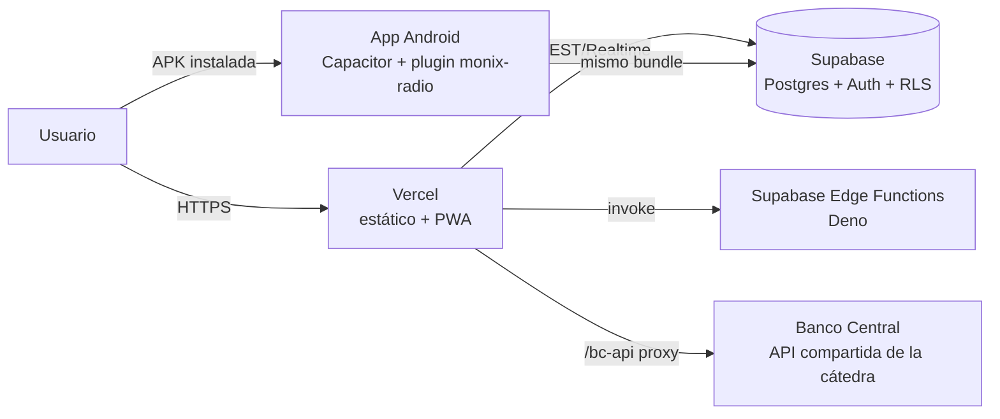

# Manual de despliegue — Monix

**Fecha:** 2026-09-30

Guía de referencia para levantar, desplegar y mantener Monix en producción. Pensada para cualquiera del equipo (o el profesor) que necesite entender cómo se pone en marcha el sistema sin tener que reconstruir el contexto desde cero. No documenta el negocio de la app (para eso están los demás `.md` de `docs/`), sólo el circuito de despliegue.

> Se buscó como referencia la documentación pública de Brocoly (producto de Binamics, la empresa del profesor en Villa María) para ver early qué convenciones de manual maneja la cátedra. No hay documentación técnica pública de ese producto (es un SaaS comercial de WhatsApp + IA, sin manuales de despliegue expuestos), así que esta guía sigue una estructura estándar de la industria: arquitectura → requisitos → variables de entorno → cada componente que se despliega → checklist post-deploy → troubleshooting.

## 1. Arquitectura en 1 minuto



| Pieza | Qué es | Dónde vive |
| --- | --- | --- |
| Frontend | React + TypeScript + Vite, PWA con Workbox | este repo, `src/` |
| Hosting web | Vercel (deploy automático al pushear a `main`) | proyecto Vercel enlazado al repo de GitHub |
| Backend | Supabase: Postgres con RLS, Auth, Realtime, Edge Functions | proyecto Supabase (ver `src/lib/supabaseClient.ts`) |
| API externa | "Banco Central" de la cátedra, simula el sistema interbancario real | `https://centralbank.brocoly.cc`, se accede vía el proxy `/bc-api` (nunca directo desde el navegador) |
| App nativa | Wrapper Android de Capacitor + plugin propio `monix-radio` (BLE/NFC/HCE para Monix Cerca y la tarjeta) | `plugins/monix-radio/` (fuente) + `android/` (generado, no se commitea) |

## 2. Requisitos previos

- Node.js 20+ y npm.
- Acceso al proyecto de Supabase (o uno nuevo, ver §5).
- El repo conectado a un proyecto de Vercel (Framework Preset: Vite).
- Para compilar el APK: Android Studio (SDK + JDK 17) y un dispositivo o emulador con Android 12+ (los permisos de Bluetooth que usa Monix Cerca cambian de forma importante a partir de esa versión).
- La API key del Banco Central de la cátedra (la entrega el profesor por curso/comisión).

## 3. Variables de entorno

Están documentadas en `.env.example` — copiarlo a `.env.local` para desarrollo:

| Variable | Para qué | De dónde sale |
| --- | --- | --- |
| `VITE_SUPABASE_URL` | URL del proyecto Supabase | Dashboard de Supabase → Project Settings → API |
| `VITE_SUPABASE_ANON_KEY` | Clave pública (anon) del cliente | Idem — nunca usar la `service_role` acá, esa sólo va del lado servidor |
| `VITE_BC_URL` | Base para llamar al Banco Central | `/bc-api` en producción (rewrite de `vercel.json`) o el proxy de `vite.config.ts` en local |
| `VITE_BC_API_KEY` | Autenticación contra el Banco Central de la cátedra | la entrega el profesor |
| `VITE_BC_ENV` | Ambiente del Banco Central (`test`/`prod`) | normalmente `test` |

**En Vercel** estas mismas variables se cargan en Project Settings → Environment Variables (no alcanza con tenerlas sólo en `.env.local`, eso no viaja al build de Vercel).

Aparte de estas, hay secrets que viven **sólo del lado de Supabase Edge Functions**, nunca en el frontend — ver §5.3.

## 4. Despliegue del frontend (Vercel)

1. Cada push a `main` dispara un deploy automático (Vercel ya está enlazado al repo de GitHub `Maxi12141/HomebankingMonix`). Un PR genera un preview deploy con su propia URL.
2. Build command: `npm run build` (que en realidad corre `tsc && vite build` — un error de tipos rompe el build a propósito, es la red de seguridad antes de subir nada).
3. Output dir: `dist/` (default de Vite, no hace falta configurarlo a mano).
4. `vercel.json` hace tres cosas que **no son opcionales**, si se reescribe hay que preservarlas:
   - Reescribe `/bc-api/:path*` hacia `https://centralbank.brocoly.cc/api/:path*` — sin esto, el banco central no responde en producción aunque funcione en local (el proxy de `vite.config.ts` sólo corre en `npm run dev`).
   - Fuerza `Cache-Control: no-cache` en `/` y `/index.html` — el service worker de la PWA necesita que el shell HTML siempre se pida fresco, sino la gente queda pegada en una versión vieja de la app indefinidamente.
   - `Permissions-Policy` habilitando cámara/micrófono/bluetooth/NFC/WebAuthn — sin esto el navegador bloquea esos permisos aunque el usuario los acepte (afecta escaneo de QR, Monix Cerca, huella y pago con NFC).
5. Verificar el deploy: abrir la preview/production URL y correr el checklist de §8 antes de dar por buena una release.
6. **Rollback**: en el dashboard de Vercel, pestaña Deployments, elegir un deploy anterior que haya sido bueno y "Promote to Production". Es inmediato y no requiere revertir nada en git (aunque revertir el commit igual es buena práctica para que `main` no mienta sobre qué está en producción).

## 5. Backend (Supabase)

### 5.1 Migraciones SQL

Las migraciones viven como archivos sueltos en `supabase/*.sql` (no hay todavía un runner tipo `supabase migration up` integrado al flujo — se aplican a mano). Para aplicar una:

- Desde Supabase Studio → SQL Editor, pegar y correr el archivo, o
- Con el MCP de Supabase (`mcp__supabase__apply_migration`) si se está trabajando con un agente que tenga esa conexión.

Orden recomendado en un proyecto nuevo: `policies.sql` primero (RLS), después el resto según el orden en que se fueron creando las features (`cuentas_moneda.sql`, `personas_credito.sql`, `personas_situacion_crediticia.sql`, `cerca_nfc.sql`, `cerca_listar_visibles.sql`, `reservas.sql`, `depositar.sql`, `prestamos.sql`, `transferencia_atomica.sql` al final, porque reemplaza funciones que dependen de las tablas anteriores).

### 5.2 Row Level Security

Todas las tablas tienen RLS activado (`policies.sql`). Si algo "no aparece" del lado del cliente pero sí existe en la tabla, sospechar primero de una política faltante antes de asumir un bug de la app.

### 5.3 Edge Functions

Hoy corren funciones Deno como `firmar-qr` (firma JWT para el QR interbancario). **Pendiente conocido:** el código fuente de estas funciones no está commiteado en este repo — se desplegaron directo al proyecto de Supabase. Recomendación para el que retome esto: crear `supabase/functions/<nombre>/index.ts` en el repo y desplegar desde ahí, para que el código de producción no viva sólo en el dashboard de Supabase.

Para desplegar una función:
```bash
npx supabase functions deploy <nombre> --project-ref <ref>
```
(requiere `supabase login` interactivo — si se está en un entorno no interactivo, usar el MCP `mcp__supabase__deploy_edge_function`).

**CORS**: Supabase no agrega headers CORS automáticamente a funciones propias. Toda función nueva que reciba `fetch` desde el navegador necesita manejar `OPTIONS` y devolver `Access-Control-Allow-Origin` a mano, o el preflight la bloquea en silencio (se vio este caso con `firmar-qr`, ver `docs/qr-interbancario-jwt.md`).

**Secrets**: se configuran en Dashboard → Edge Functions → Secrets (`Deno.env.get('NOMBRE')` del lado de la función). Ejemplo pendiente: `QR_JWT_PRIVATE_KEY` — hoy `firmar-qr` tiene un fallback embebido en el código porque no hubo forma de setear el secret desde un entorno no interactivo; migrarlo es sólo cargar el secret en el Dashboard, la función ya lo prioriza si existe.

## 6. App Android (Capacitor)

```bash
npm run cap:add     # sólo la primera vez: genera android/ (gitignored)
npm run cap:sync     # build web + cap sync + reaplica parches nativos
npm run apk:debug    # arma un APK debug (android/app/build/outputs/apk/debug)
```

- `android/` se regenera con `cap add`/`cap sync` y **no se commitea** — el plugin propio vive aparte, en `plugins/monix-radio/`, y sí está en el repo.
- `scripts/ensure-android-perms.mjs` corre automáticamente después de `cap sync`: Capacitor pisa `MainActivity.java` y el manifest en cada sync, así que este script vuelve a inyectar los permisos y el comportamiento custom de `MainActivity` (configuración de WebView, edge-to-edge, etc.). Si se agregan permisos nuevos de Android, hay que sumarlos ahí, no directo en `android/`, porque se pierden en el próximo `cap sync`.
- Para un **release firmado** (Play Store o distribución directa) hace falta generar un keystore propio y configurar `signingConfig` en `android/app/build.gradle` — no hay uno generado todavía en este proyecto; seguir la guía oficial de Capacitor/Android para firmar un `.aab` o `.apk` de release cuando llegue el momento.
- El plugin `monix-radio` declara permisos de Bluetooth (`BLUETOOTH_SCAN`, `BLUETOOTH_ADVERTISE`, `BLUETOOTH_CONNECT`) y NFC — Android 12+ los trata distinto a versiones previas, tenerlo en cuenta al testear Monix Cerca en dispositivos reales.

## 7. PWA

- Manifest e iconos generados por `vite-plugin-pwa` (`vite.config.ts`), assets en `public/` (`pwa-64x64.png`, `pwa-192x192.png`, `pwa-512x512.png`, `maskable-icon-512x512.png`).
- `registerType: 'prompt'` con registro manual en `src/main.tsx` (no automático) para poder controlar el aviso de actualización con el mismo patrón de toast que usa el resto de la app (`src/native/registrarPwa.tsx`), y para no registrar el service worker dentro de la APK de Capacitor (ahí ya está "instalada", no tiene sentido).
- El botón de instalar (`src/hooks/usePwaInstall.ts` + `src/lib/pwaInstallPrompt.ts`) depende de que el navegador dispare `beforeinstallprompt` — eso requiere HTTPS real (Vercel ya lo da) y que el manifest + service worker pasen los criterios de instalabilidad de Chrome.
- Para verificar que una build es instalable: Chrome DevTools → Application → Manifest (sin errores) y → Service Workers (activo y controlando la página), o correr Lighthouse → PWA.

## 8. Checklist post-despliegue (smoke test)

Antes de dar una release por buena, probar en la URL de producción (no sólo en local):

- [ ] Registro de una cuenta nueva completa el wizard y llega al dashboard.
- [ ] Login con email/contraseña y, en un celular, con huella.
- [ ] Transferencia interna (Monix → Monix) y externa (CBU de otro banco vía Banco Central) se acreditan y aparecen en el historial.
- [ ] QR propio se genera y un escaneo lo paga correctamente (tanto el flujo interno con seguimiento en tiempo real como el interbancario firmado).
- [ ] Simulador de Préstamos calcula cuota/total y permite solicitar uno.
- [ ] El botón "Instalar app" funciona en Chrome/Android (no cae siempre a "no disponible").
- [ ] Abrir la app instalada como PWA y confirmar que detecta una versión nueva sin necesidad de desinstalar/reinstalar.

## 9. Troubleshooting conocido

| Síntoma | Causa típica | Dónde mirar |
| --- | --- | --- |
| El Banco Central da 404/CORS en producción pero anda en local | Falta el rewrite `/bc-api` en `vercel.json`, o se llamó directo a `centralbank.brocoly.cc` desde el navegador | `vercel.json`, `services/bancoCentral.ts` |
| Una Edge Function nueva falla con "blocked by CORS policy" | Falta manejar `OPTIONS` + `Access-Control-Allow-Origin` en la función | código de la función en Supabase, ver ejemplo en `docs/qr-interbancario-jwt.md` |
| La PWA instalada queda en una versión vieja | El service worker no fuerza el chequeo de actualización seguido, o el HTML quedó cacheado | `src/native/registrarPwa.tsx`, headers `no-cache` de `vercel.json` |
| El botón de instalar siempre dice "no disponible" en Chrome | El evento `beforeinstallprompt` se perdió porque nadie lo escuchaba a tiempo (splash screen inicial) | `src/lib/pwaInstallPrompt.ts` — debe importarse eager desde `main.tsx` |
| Después de `cap sync`, se perdió un permiso o un cambio en `MainActivity` | Capacitor regenera esos archivos en cada sync | agregar el cambio en `scripts/ensure-android-perms.mjs`, no en `android/` directamente |

## 10. Pendientes / mejoras futuras

- Commitear el código de las Edge Functions bajo `supabase/functions/` en vez de dejarlo sólo en el dashboard de Supabase.
- Migrar `QR_JWT_PRIVATE_KEY` (y cualquier otro secret embebido) a un secret real de Supabase.
- Automatizar la aplicación de migraciones SQL (hoy es 100% manual).
- No hay CI configurado (`.github/workflows` no existe) — ni siquiera corre `tsc`/lint en cada PR más allá de lo que haga Vercel al buildear.
- Generar y documentar el keystore de release para Android cuando se necesite distribuir un APK/AAB firmado.
