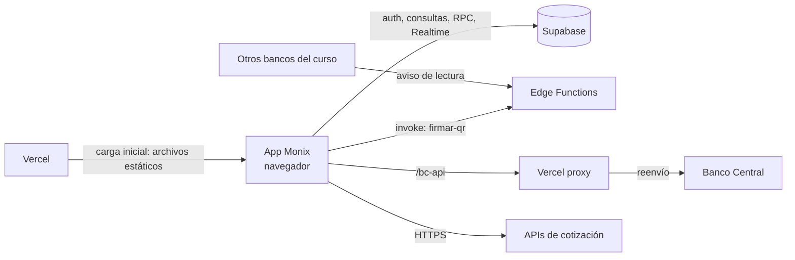
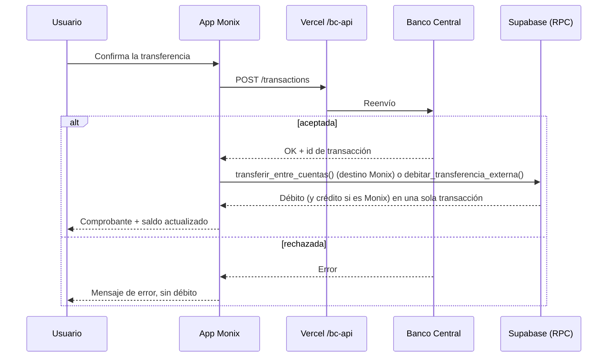
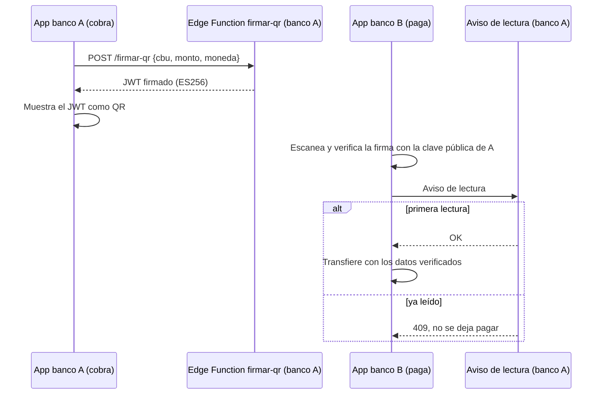

# Manual de despliegue — Monix

**Versión:** 1.1 · **Fecha:** 2026-10-02 · **Alumnos:** Maximiliano Turaglio y Diego Urenda · **Materia:** Práctica Profesionalizante I

Guía para levantar, desplegar y mantener Monix en producción desde este repositorio, en una cuenta nueva de Supabase y Vercel. Versión publicada (con diagramas): https://claude.ai/artifact/7f3fiyZ8qzC7kkYFazzStE

Monix es una aplicación web (React + TypeScript + Vite) con backend en Supabase. Un único build se despliega en Vercel y se instala como PWA en desktop, iOS y Android. No hay app nativa.

Referencias: [The Twelve-Factor App](https://12factor.net/), estructura de runbooks de respuesta a incidentes, `README.md`, `docs/qr-interbancario-jwt.md` y `docs/auditoria-completa-2026-09-21.md`.

## 1. Glosario

| Término | Definición |
| --- | --- |
| **CBU** | Clave Bancaria Uniforme. Identificador de cuenta bancaria en Argentina (22 dígitos). |
| **Alias** | Identificador alfanumérico asociado a un CBU (ej. `cima.alba.isla`). |
| **BCRA** | Banco Central de la República Argentina. En el proyecto, simulado por la API de la cátedra ("Banco Central"). |
| **bankCode** | Código de banco asignado por el Banco Central. Monix: `3` (entorno `test`). |
| **Situación crediticia** | Categoría 1 a 5 (BCRA) que clasifica el cumplimiento de deudas de una persona. Determina la oferta de préstamo. |
| **TNA** | Tasa Nominal Anual. |
| **RLS** | Row Level Security. Políticas de Postgres que restringen lectura y escritura por fila según el usuario autenticado. |
| **RPC** | Función de Postgres invocada desde el cliente (`supabase.rpc()`). En Monix, funciones `SECURITY DEFINER` que ejecutan operaciones de saldo de forma atómica. |
| **Edge Function** | Función serverless (Deno) ejecutada en Supabase. Aloja lógica que requiere secretos. |
| **JWT** | JSON Web Token. Token con firma digital. Se usa en la sesión de Supabase y en el QR interbancario (ES256). |
| **Proxy** | Intermediario que reenvía solicitudes. Vercel reenvía `/bc-api/...` al Banco Central. |
| **CORS** | Política del navegador que bloquea solicitudes a otro dominio no autorizado. Motivo del proxy. |
| **PWA** | Progressive Web App. Aplicación web instalable, con ícono propio y ejecución a pantalla completa. |
| **Service Worker** | Script en segundo plano del navegador. Gestiona la caché y habilita la PWA. |
| **WebAuthn** | API del navegador para autenticarse con la huella, la cara o el PIN del dispositivo. La usa el ingreso con biometría. |
| **Aviso de lectura** | Notificación que un banco envía al banco emisor cuando lee uno de sus QR. Cierra el QR (un solo uso) y le avisa al dueño. |

## 2. Arquitectura

Monix no tiene servidor de aplicación propio. Vercel sirve los archivos estáticos; a partir de la carga, la aplicación se ejecuta en el navegador y es el único componente que se comunica con el resto.



Vercel figura dos veces porque cumple dos funciones: hosting y proxy. Supabase no se comunica con el Banco Central.

| Componente | Tecnología | Ubicación |
| --- | --- | --- |
| Frontend | React 18 + TypeScript + Vite 6, Tailwind, Zustand, PWA con Workbox | `src/` |
| Hosting | Vercel, deploy automático en push a `main` | `vercel.json`, `.vercel/project.json` |
| Backend | Supabase: Postgres + RLS, Auth, Realtime, RPC | `supabase/*.sql`, `src/lib/supabaseClient.ts` |
| Edge Functions | `firmar-qr` y `qr-lectura` (Deno) | `supabase/functions/` (§7.6) |
| API externa | Banco Central de la cátedra | `src/services/bancoCentral.ts` |
| Cotizaciones | `dolarapi.com` y `api.argentinadatos.com`, sin credenciales | `src/services/mercadoFinanciero.ts` |

Un solo entorno: no hay staging, `main` es producción. Para probar una migración riesgosa, usar una rama de base de datos temporal en Supabase.

### 2.1 Adhesión a The Twelve-Factor App

| Principio | Implementación en Monix |
| --- | --- |
| **Config** | Configuración en variables de entorno (`VITE_*`). Excepción: `x-environment` fijo en `test` (§6). |
| **Backing services** | Supabase, Banco Central y APIs de cotización como recursos externos intercambiables. |
| **Build, release, run** | Etapas separadas: `npm run build` → deploy en Vercel → CDN. |
| **Dev/prod parity** | Parcial: el proxy `/bc-api` se resuelve con `vite.config.ts` en local y con `vercel.json` en producción. |
| **Disposability** | Frontend estático sin estado en servidor. Las instancias son descartables. |
| **Logs** | No cumple: sin logs centralizados (§11). Deuda técnica registrada. |

## 3. Flujos de negocio críticos

### 3.1 Transferencia (interna o interbancaria)



Toda transferencia se registra primero en el Banco Central, también entre cuentas Monix. Cada operación lleva un `operacion_id`: si el paso de Supabase falla, un reintento no reenvía la orden al Banco Central y la RPC aplica el débito una sola vez (índice único sobre `movimientos.operacion_id`, `transferencia_atomica.sql`). Si la página se cierra entre los dos pasos, la operación queda aceptada en el Banco Central y sin débito local: ante diferencias de saldo, verificar este caso primero.

Las transferencias que llegan de otros bancos se acreditan con `useSyncTransferenciasEntrantes` (consulta al Banco Central cada 2 minutos). El `bc_transaccion_id` evita acreditar dos veces la misma operación.

### 3.2 Pago con QR interbancario



Especificación: `docs/qr-interbancario-jwt.md`. Verificación en `src/lib/qrJwt.ts` contra `BANCOS_CONOCIDOS`. Monix recibe los avisos en la Edge Function `qr-lectura`, que los guarda en `qr_lecturas`; el dueño del QR los ve por Realtime. Las direcciones de aviso de cada banco están en `BANCOS_AVISO`.

## 4. Requisitos previos

| Requisito | Detalle |
| --- | --- |
| Node.js / npm | Node ≥ 18, npm ≥ 9. Sin `engines` ni `.nvmrc` en el repositorio. |
| Cuenta de GitHub | Acceso de lectura al repositorio. Escritura para disparar deploys. |
| Cuenta de Supabase | Un proyecto (plan gratuito suficiente). |
| Cuenta de Vercel | Vinculada a GitHub. |
| Supabase CLI | Vía `npx supabase`. Necesaria sólo para desplegar Edge Functions. |
| API key del Banco Central | Provista por la cátedra para el banco Monix. |

## 5. Entorno local

```bash
git clone https://github.com/Maxi12141/HomebankingMonix.git
cd HomebankingMonix
npm install
cp .env.example .env.local   # completar valores, ver §6
npm run dev                  # http://localhost:5173
```

| Comando | Función |
| --- | --- |
| `npm run dev` | Servidor de desarrollo con hot reload |
| `npm run build` | `tsc && vite build`. Build de producción en `dist/` |
| `npm run preview` | Sirve el build de producción en local (con service worker, para probar la PWA) |
| `npm run dev:celular` | Servidor de desarrollo expuesto en la red local, para probar desde el teléfono |
| `node --env-file=.env.local scripts/seed-central-deudores.mjs` | Opcional. Informa deudas ficticias a la Central de Deudores para probar Préstamos |

En local, el proxy `/bc-api` lo resuelve `vite.config.ts` (sólo en `dev` y `preview`). Si faltan `VITE_SUPABASE_URL` o `VITE_SUPABASE_ANON_KEY`, la aplicación muestra `MissingEnvScreen`. No hay tests automatizados ni CI (no existe `.github/workflows`): el único control previo al deploy es el chequeo de tipos de `tsc`, más el checklist de §13.

## 6. Variables de entorno

| Variable | Uso | Origen |
| --- | --- | --- |
| `VITE_SUPABASE_URL` | URL del proyecto | Supabase → Project Settings → API |
| `VITE_SUPABASE_ANON_KEY` | Clave pública del cliente | Ídem. Nunca la `service_role` |
| `VITE_BC_URL` | URL base del Banco Central | Siempre `/bc-api`. Nunca la URL absoluta |
| `VITE_BC_API_KEY` | Header `x-api-key` del Banco Central | Provista por la cátedra |
| `VITE_BC_ENV` | Ambiente del Banco Central | `test` |

Replicar en Vercel → Project Settings → Environment Variables (Production y Preview). `.env` y `.env.local` están en `.gitignore`. Si una clave se commitea, rotarla: borrar el commit no alcanza.

`VITE_BC_ENV` no se lee actualmente: el header `x-environment` está fijo en `test` en `src/services/bancoCentral.ts`. El pase a `prod` requiere modificar ese archivo.

Aparte, hay un secret que vive sólo en las Edge Functions de Supabase: `QR_JWT_PRIVATE_KEY` (§7.6).

## 7. Backend en Supabase

### 7.1 Proyecto

Crear un proyecto en Supabase. Registrar la URL y la clave `anon` (§6). Habilitar el proveedor Email + Password en Authentication → Providers.

### 7.2 Esquema base

Aplicar primero el esquema base (tablas `personas`, `cuentas` y `movimientos`), exportado del proyecto en uso. Los archivos de §7.3 agregan columnas, tablas y funciones sobre esas tablas.

### 7.3 Orden de migraciones

Archivos en `supabase/*.sql`, aplicados a mano en el SQL Editor (no hay runner de migraciones). Orden derivado de las dependencias entre archivos; no validado sobre un proyecto vacío.

| # | Archivo | Contenido |
| --- | --- | --- |
| 0 | _esquema base_ | §7.2 |
| 1 | `reservas.sql` | Tabla `reservas` + RLS |
| 2 | `cuentas_interes.sql` | `tasa_anual`, `ultima_interes_at` en `cuentas` |
| 3 | `cuentas_moneda.sql` | `moneda` (ARS/USD) en `cuentas` |
| 4 | `personas_credito.sql` | `sueldo_acreditado`, `ingreso_mensual` |
| 5 | `personas_situacion_crediticia.sql` | Situación informada al Banco Central |
| 6 | `prestamos.sql` | Tabla `prestamos` + RLS |
| 7 | `policies.sql` | RLS de `personas`, `cuentas`, `movimientos`, `reservas` |
| 8 | `nfc_cobros.sql` | Esquema `private`, `cobros_nfc` (cobros con QR), rate limiting (`private.enforce_rate`), RPC de cobro y pago con QR, `tarjeta_congelada` en `cuentas`; agrega `cuentas` y `cobros_nfc` a Realtime |
| 9 | `depositar.sql` | RPC `depositar_en_cuenta` |
| 10 | `transferencia_atomica.sql` | `operacion_id`, `transferir_entre_cuentas`, `debitar_transferencia_externa`, `convertir_moneda_propia` |
| 11 | `metas_comunes.sql` | Metas comunes: tablas de metas, miembros, aportes y votaciones + RPC (crear, invitar, unirse, aportar, proponer desembolso, votar). El dinero sale sólo con mayoría |
| 12 | `qr_lecturas.sql` | Tabla `qr_lecturas` (avisos de lectura de QR); agrega a Realtime |

Verificación: Database → Publications → `supabase_realtime` debe incluir `cuentas`, `cobros_nfc` y `qr_lecturas`. Sin `cuentas`, el saldo no se actualiza en tiempo real.

**Migraciones destructivas:** el plan gratuito no incluye point-in-time recovery. Generar un dump previo (Database → Backups, o `pg_dump`) o validar en una rama de base de datos temporal.

### 7.4 Auth

- Desactivar "Confirm email" (Authentication → Settings). `signUp()` debe dejar sesión inmediata; con confirmación activa el registro queda sin sesión.
- Redirect URLs: agregar `<url-de-producción>/restablecer-contrasena` y `http://localhost:5173/restablecer-contrasena` (Authentication → URL Configuration).
- Plantilla de mail: `docs/email-recuperar-contrasena.html` en Authentication → Email Templates → Reset Password.

### 7.5 Datos iniciales en el Banco Central

El registro de usuarios crea la persona en el Banco Central (`POST /persons`) y obtiene CBU y alias. No se requiere carga manual. El script `seed-central-deudores.mjs` es opcional y sólo afecta la Central de Deudores del entorno `test`.

### 7.6 Edge Functions `firmar-qr` y `qr-lectura`

`firmar-qr` firma los QR interbancarios (JWT ES256); el cliente la invoca desde `src/lib/qrJwt.ts`, que también verifica los QR recibidos. `qr-lectura` recibe los avisos de lectura que mandan los bancos (y la propia app) cuando leen un QR de Monix. El código de las dos está en `supabase/functions/`.

1. Generar un par de claves ES256 (P-256) en formato JWK.
2. Cargar la clave privada como secret `QR_JWT_PRIVATE_KEY` (Edge Functions → Secrets). El código no tiene clave embebida: sin el secret, `firmar-qr` responde error.
3. Aplicar `qr_lecturas.sql` (§7.3). `qr-lectura` escribe ahí con la `service_role`, que Supabase le inyecta sola como variable de entorno.
4. Desplegar. `qr-lectura` va sin verificación de JWT, porque los otros bancos no tienen usuarios en nuestro Supabase:

   ```bash
   npx supabase login
   npx supabase functions deploy firmar-qr --project-ref <ref>
   npx supabase functions deploy qr-lectura --no-verify-jwt --project-ref <ref>
   ```

5. Actualizar la clave pública de Monix en dos lugares: `publicKeyJwk` y `kid` en `BANCOS_CONOCIDOS` (`src/lib/qrJwt.ts`) y `MONIX_PUBLIC_JWK` en `supabase/functions/qr-lectura/index.ts`. Si no corresponden a la clave privada, los QR propios no verifican y los avisos se rechazan.
6. Distribuir al resto de los bancos del curso: `bankCode`, `kid`, la clave pública (JWK) y la dirección de aviso `<VITE_SUPABASE_URL>/functions/v1/qr-lectura`.

**CORS:** Supabase no agrega CORS a las funciones propias. Toda función que se llame desde el navegador tiene que responder `OPTIONS` y devolver `Access-Control-Allow-Origin`.

Contrato de las funciones: `docs/qr-interbancario-jwt.md` §4 (firma) y §12–13 (aviso de lectura).

## 8. Frontend en Vercel

### 8.1 Alta del proyecto

| Parámetro | Valor |
| --- | --- |
| Origen | Add New → Project → importar el repositorio de GitHub |
| Framework Preset | Vite |
| Build Command | `npm run build` |
| Output Directory | `dist` |
| Install Command | `npm install` |
| Node.js Version | 18 o superior |
| Environment Variables | Las cinco de §6, en Production y Preview |
| Production Branch | `main` |

`.vercelignore` excluye `dist/` y `node_modules/` del upload. Proyecto actual: `monix-homebanking` (`.vercel/project.json`).

### 8.2 Pipeline

Cada push a `main` dispara un deploy de producción; los pull requests generan preview deploys. `npm run build` ejecuta `tsc && vite build`: un error de tipos cancela el deploy. El build publicado se identifica en `/monix-build.txt` (timestamp del build).

### 8.3 Configuración obligatoria en `vercel.json`

- **Rewrite** `/bc-api/:path*` → `https://centralbank.brocoly.cc/api/:path*`. Sin él, el Banco Central no responde en producción.
- **Rewrite** `/(.*)` → `/index.html`. Fallback de SPA para las rutas de React Router.
- **`Cache-Control: no-cache`** en `/`, `/index.html` y `/monix-build.txt`. Sin él, se retienen versiones anteriores.
- **`Permissions-Policy`** para cámara, micrófono y WebAuthn (huella). Sin él, el navegador bloquea esos permisos.

### 8.4 Rollback

Vercel → Deployments → seleccionar un deploy anterior estable → **Promote to Production**. Efecto inmediato. Revertir además el commit en `main` para mantener consistencia con producción. El rollback no revierte migraciones de base de datos.

## 9. PWA

Monix se distribuye sólo como PWA: no hay app nativa. Las funciones del dispositivo se resuelven con APIs del navegador.

### Instalación y actualización

- Manifest e íconos generados por `vite-plugin-pwa` (`vite.config.ts`). Assets en `public/`.
- `registerType: 'prompt'` con registro manual en `src/lib/registrarPwa.tsx` (llamado desde `main.tsx`). Una versión nueva se aplica sola en los primeros segundos de abrir la app; después se avisa con un toast "Actualizar".
- `index.html` excluido del precache (`globIgnores`) y servido con `NetworkFirst`.
- Botón "Instalar" (`usePwaInstall.ts` + `pwaInstallPrompt.ts`) en la Landing y el Login: depende de `beforeinstallprompt`. Requiere HTTPS y cumplir los criterios de instalabilidad de Chrome. Se oculta si la app ya está instalada.
- Verificación: DevTools → Application → Manifest / Service Workers, o Lighthouse → PWA.

### Funciones del dispositivo

| Función | API del navegador | Dónde |
| --- | --- | --- |
| Ingreso con huella, cara o PIN | WebAuthn (autenticador de plataforma) | `src/lib/biometria.ts` |
| Leer QR | `getUserMedia` (cámara en vivo) o una foto del QR | `src/lib/scanQr.ts` |
| Dictado a Moni | Web Speech API (Chrome y Edge) | `src/lib/vozMoni.ts` |
| Pedir permisos de una vez | Cámara, micrófono y notificaciones | `src/lib/permisos.ts` (botón en Perfil) |

### Compatibilidad del botón "Instalar"

| Navegador | Comportamiento |
| --- | --- |
| Chrome / Edge (Android y desktop) | Emite `beforeinstallprompt`. Instalación directa. |
| Safari (iOS y macOS) | No emite el evento. Instalación manual: Compartir → Agregar a Inicio. |
| Firefox | No soporta el evento. El botón muestra "no disponible". |

## 10. Seguridad

- **RLS obligatorio** en toda tabla nueva. Una tabla sin política queda expuesta a lectura y escritura para cualquier usuario autenticado.
- **Operaciones de saldo sólo por RPC.** Las funciones `SECURITY DEFINER` (`search_path = ''`, `FOR UPDATE`) son el único medio para modificar cuentas de terceros. Incluyen rate limiting por usuario (`private.enforce_rate`).
- **`service_role` no se expone en el frontend.** El cliente usa sólo la clave `anon`, sujeta a RLS.
- **Clave privada del QR:** sólo como secret `QR_JWT_PRIVATE_KEY` de `firmar-qr`. El código no tiene clave embebida. La clave pública sí está en el código (`qrJwt.ts` y `qr-lectura`) y no es secreta.
- **`service_role` sólo dentro de `qr-lectura`**, como variable de entorno que inyecta Supabase. La función acepta un aviso sólo si el QR trae la firma de Monix.
- **`Permissions-Policy`** en `vercel.json`: no eliminar al editar el archivo.
- **Rate limiting de login sólo en cliente** (backoff progresivo en `LoginPage.tsx`). Sin límite del lado del servidor. Limitación conocida.
- **Credenciales:** no commitear `.env`, `.env.local` ni claves. Ante una filtración, rotar la clave.

## 11. Monitoreo y logs

Sin error tracking integrado (Sentry o similar). Diagnóstico manual:

| Evento | Fuente |
| --- | --- |
| Falla de build en Vercel | Vercel → Deployments → deploy fallido → Build Logs |
| Error en runtime | Consola del navegador. SPA estática, sin logs de servidor. |
| Error en RPC o RLS | Supabase → Logs → Postgres / API |
| Falla de Edge Function | Supabase → Edge Functions → `firmar-qr` / `qr-lectura` → Logs |
| Avisos de seguridad | Supabase → Advisors → Security |
| Build en ejecución | `/monix-build.txt` (timestamp del build) |

## 12. Accesos y roles

Maximiliano Turaglio y Diego Urenda coadministran todos los recursos del proyecto. Para pedir acceso, alcanza con hablar con cualquiera de los dos.

| Recurso | Administran | Solicitud de acceso |
| --- | --- | --- |
| Repositorio GitHub | Maximiliano Turaglio y Diego Urenda | Alta como colaborador, o abrir un PR |
| Proyecto Vercel `monix-homebanking` | Maximiliano Turaglio y Diego Urenda | Alta como miembro del proyecto |
| Proyecto Supabase | Maximiliano Turaglio y Diego Urenda | Alta como miembro de la organización |
| API Banco Central | Cátedra | API key asignada por curso/comisión |

## 13. Checklist post-despliegue

Antes de dar una release por buena, probar en la URL de producción:

- [ ] El registro completa los tres pasos y llega al dashboard.
- [ ] Login con email y contraseña y, en un celular, con huella.
- [ ] Transferencia interna (Monix → Monix) y externa (CBU de otro banco) se acreditan y aparecen en el historial.
- [ ] El QR propio se genera ("Generar QR") y un escaneo lo paga; un segundo escaneo del mismo QR se rechaza.
- [ ] El simulador de Préstamos calcula cuota y total y permite solicitar uno.
- [ ] Una meta común se crea, recibe aportes y pide votación para retirar.
- [ ] El botón "Instalar app" funciona en Chrome/Android.
- [ ] La app instalada detecta una versión nueva sin reinstalar.

## 14. Troubleshooting

| Síntoma | Causa probable |
| --- | --- |
| Pantalla `MissingEnvScreen` | Faltan o son inválidas `VITE_SUPABASE_URL` / `VITE_SUPABASE_ANON_KEY` en el build |
| Banco Central devuelve 404/CORS en producción | Falta el rewrite `/bc-api` en `vercel.json`, o `VITE_BC_URL` apunta a la URL absoluta |
| 404 al recargar una ruta interna | Falta el rewrite de SPA `/(.*)` → `/index.html` |
| Error "function ... does not exist" en una operación | Migración de §7.3 no aplicada |
| Saldo no se actualiza en tiempo real | `cuentas` fuera de la publicación `supabase_realtime` |
| Edge Function bloqueada por CORS | No maneja `OPTIONS` ni devuelve el header |
| QR propio "no válido" | `publicKeyJwk`/`kid` de `qrJwt.ts` no corresponden a la clave de `firmar-qr` |
| Otro banco no puede avisar la lectura de un QR (401) | `qr-lectura` desplegada sin `--no-verify-jwt` |
| "Este QR ya fue escaneado" al pagar | Comportamiento esperado: el QR es de un solo uso. Generar uno nuevo |
| No aparece la opción de huella | El dispositivo no tiene autenticador de plataforma (WebAuthn) o la página no está en HTTPS |
| PWA instalada no se actualiza | Revisar `src/lib/registrarPwa.tsx` y los headers `no-cache` |
| "Instalar" siempre no disponible | Evento `beforeinstallprompt` no capturado (`pwaInstallPrompt.ts`, importado desde `main.tsx`) |
| Usuario registrado sin sesión | "Confirm email" activo en Supabase (§7.4) |
| Enlace de recuperación de contraseña rechazado | Falta la Redirect URL en Supabase (§7.4) |

---

Pendientes del proyecto: `docs/auditoria-completa-2026-09-21.md`.
