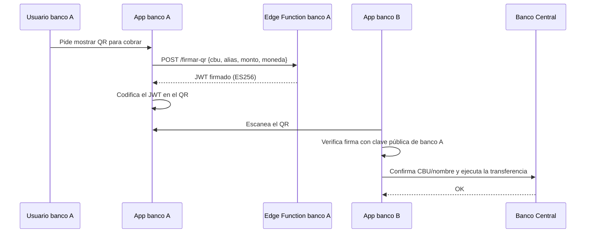

# QR de transferencia interbancaria firmado (JWT)

**Fecha:** 2026-09-21

Formato común de QR firmado (JWT, ES256) para que las apps de distintos bancos del curso lean y verifiquen transferencias entre sí, sin compartir base de datos ni backend. Cada banco firma sus propios QRs con su clave privada; el resto verifica con la clave pública correspondiente.

## 1. Roles

Cada banco cumple los dos roles: emite QRs para cobrar y lee QRs de otros bancos para pagar.

| Rol | Qué hace |
| --- | --- |
| Emisor (banco que muestra el QR) | Genera el JWT firmado con su clave privada y lo codifica en el QR |
| Receptor (banco que escanea) | Decodifica el JWT, verifica la firma con la clave pública del emisor, y usa los datos (CBU, alias, monto) para armar la transferencia |

## 2. Formato del JWT

**Header**

| Campo | Valor |
| --- | --- |
| `alg` | `ES256` |
| `typ` | `JWT` |
| `kid` | id de la clave del banco emisor (permite rotarla a futuro) |

**Claims**

| Claim | Tipo | Obligatorio | Descripción |
| --- | --- | --- | --- |
| `iss` | number | sí | `bankCode` del banco emisor |
| `cbu` | string | sí | CBU de la cuenta destino |
| `alias` | string | no | alias de la cuenta, si tiene |
| `monto` | number | no | monto sugerido; si no está, lo carga quien paga |
| `moneda` | string | sí | `"ARS"` o `"USD"` |
| `iat` | number (unix) | sí | momento de emisión |
| `exp` | number (unix) | sí | vencimiento — recomendado `iat + 600` (10 min) |

## 3. Flujo completo



## 4. Contrato de la Edge Function que firma

`POST /functions/v1/firmar-qr`

Request:
```json
{ "cbu": "...", "alias": "opcional", "monto": 1500.50, "moneda": "ARS" }
```

Response:
```json
{ "jwt": "eyJhbGciOiJFUzI1NiIsInR5cCI6IkpXVCIsImtpZCI6Im1vbml4LTEifQ...." }
```

La clave privada vive únicamente como *secret* de esta función — nunca en el bundle del frontend.

## 5. Verificación del lado del que escanea

1. Decodificar el header del JWT (sin verificar todavía) y sacar `kid`/`iss`.
2. Buscar la clave pública correspondiente a ese `iss` en la tabla local de bancos conocidos.
3. Si el `iss` no está en la tabla: avisar "origen no verificado" pero seguir permitiendo el pago (no romper con bancos no participantes).
4. Si está: verificar firma y `exp` con una librería JWT (`jose` funciona en el navegador vía WebCrypto).
5. Firma inválida o vencida → rechazar con un mensaje claro ("Este código no es válido o venció").
6. Firma válida → extraer `cbu`/`alias`/`monto`/`moneda` de los claims y prellenar la transferencia.

## 6. Distribución de claves públicas entre bancos

No hay autodiscovery — se intercambia a mano entre los equipos participantes, una vez por banco:

| Campo | Descripción |
| --- | --- |
| `bankCode` | el bankCode real de ese banco en el Banco Central |
| `kid` | id de su clave |
| `publicKeyJwk` | la clave pública en formato JWK (no es secreta) |

Cada equipo agrega estas filas a su propia tabla local hardcodeada.

## 7. Compatibilidad con bancos que no lo implementen

Orden de intentos al escanear, para no romper nada:

1. ¿Es un JWT válido y verificable? → usarlo.
2. ¿Es un JWT pero de un `iss` desconocido? → usarlo, avisando que no se pudo verificar el origen.
3. ¿Es JSON plano `{cbu, alias, monto, moneda}`? → usarlo tal cual, sin verificación.
4. ¿Es uno de los formatos internos actuales (`MONIXQR:`, `MONIXPAY:`)? → flujo interno de siempre.

## 8. Plan de testing

- [ ] Generar un par de claves de prueba y confirmar que `jose` firma/verifica en el navegador.
- [ ] Firmar un JWT de prueba desde la Edge Function y decodificarlo a mano (jwt.io) para chequear los claims.
- [ ] Escanear un QR propio con la propia app (ida y vuelta) y confirmar que arma bien la transferencia.
- [ ] Probar un JWT vencido (`exp` en el pasado) y confirmar que se rechaza con el mensaje correcto.
- [ ] Probar un JWT con la firma alterada (cambiar un carácter) y confirmar que se rechaza.
- [ ] Intercambiar clave pública con un compañero de otro banco y escanear su QR real desde tu app.
- [ ] Escanear un QR de un banco que NO implementó esto y confirmar que cae al fallback sin romper.
- [ ] Confirmar que el QR sigue siendo legible (un JWT es más largo que el JSON corto de antes).

## 9. Checklist de tareas — de tu lado (Monix)

- [ ] Generar par de claves ES256.
- [ ] Guardar la clave privada como *secret* de una Edge Function en Supabase.
- [ ] Crear la Edge Function `firmar-qr`.
- [ ] Cambiar `MiCodigoQr` (`src/components/NfcPayPanels.tsx`) para pedir el JWT a la Edge Function en vez de usar el id interno de cobro/cuenta.
- [ ] Agregar la librería `jose` al frontend.
- [ ] Agregar la tabla local de claves públicas conocidas (`bankCode → clave pública`).
- [ ] Extender `aplicarQr`/`parseRadioPayload` (`src/lib/tokens.ts`, `src/components/NfcPayPanels.tsx`) para detectar y verificar JWT antes de los formatos actuales.
- [ ] Correr el checklist de testing de la sección 8.

## 10. Checklist de tareas — para cada banco que se sume

- [ ] Generar su propio par de claves (nunca compartir la privada entre equipos).
- [ ] Implementar su propio endpoint de firma con los mismos nombres de claims que esta spec.
- [ ] Implementar su propio lector/verificador con la misma lógica de la sección 5.
- [ ] Mandar `bankCode` + `kid` + clave pública (JWK) a los demás equipos participantes.
- [ ] Probar escaneando el QR de al menos otro banco participante.

## 11. Qué falta acordar con los otros equipos

- Confirmar que todos usan `ES256` (no RS256 ni HS256).
- Confirmar los nombres exactos de los claims de la sección 2 (si alguien usa otros nombres, no hay interoperabilidad).
- Formato de intercambio de clave pública: JWK (recomendado, lo entiende `jose` directo).
- Duración de `exp`: sugerido 10 minutos, pero no es crítico que coincida entre bancos — cada uno valida el suyo.
